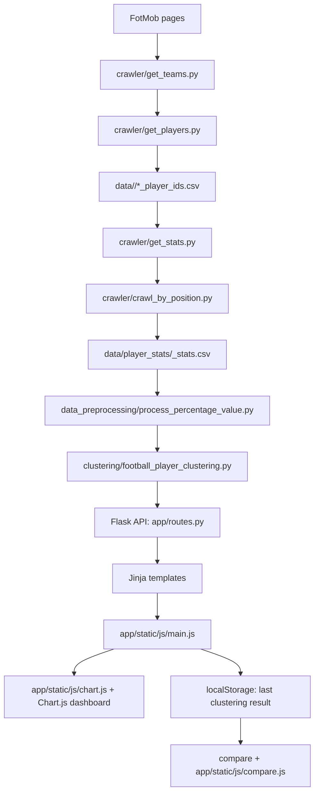

# ScoutMetric Pro - Football Player Clustering Dashboard


## Table Of Contents

- [Overview](#overview)
- [Key Features](#key-features)
- [System Architecture](#system-architecture)
- [Project Structure](#project-structure)
- [System Requirements](#system-requirements)
- [Installation](#installation)
- [Dataset](#dataset)
- [Configuration](#configuration)
- [Model Training](#model-training)
- [Evaluation And Results](#evaluation-and-results)
- [Web Demo / Inference](#web-demo--inference)
- [Testing](#testing)
- [Roadmap](#roadmap)
- [Contributing](#contributing)
- [License](#license)
- [Contact And Citation](#contact-and-citation)

## Overview

ScoutMetric Pro is a football analytics application built with Flask and scikit-learn. It clusters football players by playing style or performance profile using per-90 statistics collected from FotMob.

The project covers an end-to-end data workflow: crawling football data with Selenium, storing it as CSV files, preprocessing player statistics by position group, running unsupervised clustering models, and visualizing the results in an interactive web dashboard.

The target users are ML engineers, football analysts, data analysts, scouts, data mining students, and recruiters reviewing this as a portfolio project.

Important design decisions:

- The project uses CSV files instead of a database server to keep the workflow easy to inspect and reproduce.
- Each position group has its own schema and feature engineering logic.
- `RobustScaler` is used before clustering to reduce the impact of outliers in football performance data.
- Clustering quality is evaluated with internal metrics because the project does not include ground-truth labels.
- The web interface uses Flask, Jinja2, vanilla JavaScript, Tailwind CDN, and Chart.js, with chart rendering isolated in `app/static/js/chart.js`.

## Key Features

- Crawls football teams, player IDs, and per-90 player statistics from FotMob with Selenium.
- Organizes player data into 6 position groups: goalkeeper, defender, fullback, midfielder, winger, and striker.
- Performs position-specific feature engineering for criteria such as `Style`, `Pressing`, and `Duel`.
- Supports K-Means, DBSCAN, and Gaussian Mixture Model clustering.
- Selects K using Elbow, Silhouette Score, Davies-Bouldin, or a Hybrid method.
- Selects the best GMM covariance type by BIC across `full`, `tied`, `diag`, and `spherical`.
- Computes clustering metrics including Silhouette, Davies-Bouldin, Calinski-Harabasz, Inertia, BIC, AIC, and Noise Ratio.
- Provides a Flask dashboard with scatter plots, K-evaluation charts, radar charts, heatmaps, and cluster summaries.
- Supports chart download and a player comparison page for inspecting two clustered players side by side.
- Exposes JSON API endpoints for parameter loading, raw feature preview, clustering, and K evaluation.

## System Architecture



Data flow:

```text
Input
  FotMob league/team/player pages
  data/<league>/*_player_ids.csv
  data/player_stats/<position>_stats.csv

Processing
  Crawl team IDs
  Crawl player IDs
  Crawl player stats per 90
  Map raw positions into position groups
  Normalize percentage columns
  Filter players by league and minutes threshold
  Engineer features by criteria
  Scale data with RobustScaler
  Fit K-Means, DBSCAN, or GMM
  Compute clustering evaluation metrics

Output
  Position-level CSV files
  JSON API responses
  Scatter, radar, heatmap, and K-evaluation charts
  Player comparison view backed by the latest clustering result in browser localStorage
```

| Component | Role |
|---|---|
| `app.py` | Entry point for the Flask development server at `http://127.0.0.1:5000`. |
| `app/__init__.py` | Flask application factory and Blueprint registration. |
| `app/routes.py` | Defines HTML routes and JSON API routes for parameters, preview data, clustering, and K evaluation. |
| `app/templates/` | Jinja2 templates for the dashboard layout and chart sections. |
| `app/static/js/main.js` | Handles UI state, API calls, form events, and delegates chart rendering to `ScoutMetricCharts`. |
| `app/static/js/chart.js` | Contains Chart.js rendering logic for scatter charts, K-evaluation charts, radar charts, heatmaps, cluster summaries, and evaluation cards. |
| `app/static/js/compare.js` | Reads the latest clustering result from browser localStorage and renders side-by-side player comparison, radar, pitch position, related players, and metric breakdowns. |
| `clustering/football_player_clustering.py` | Core business logic for reading CSV data, filtering, feature engineering, scaling, clustering, and metrics. |
| `clustering/optimal_k.py` | Helper functions for Elbow, Silhouette, Davies-Bouldin, and Hybrid K selection. |
| `crawler/` | Selenium-based pipeline for team IDs, player IDs, and player stats from FotMob. |
| `data_preprocessing/` | Scripts for data cleaning and percentage normalization. |
| `data/` | Local CSV dataset. This directory is ignored by Git. |
| `backup_data/` | Local backup of CSV datasets. This directory is ignored by Git. |

## Project Structure

```text
Football_Player_Clustering/
|-- .gitignore                         # Ignore rules for caches, virtual environments, env files, data, and backups
|-- README.md                          # Main project documentation
|-- HANDOVER.md                        # Existing internal handover document
|-- update.txt                         # Notes about GMM confidence, covariance type, and recent checks
|-- requirements.txt                   # Python dependencies
|-- app.py                             # Flask app entry point
|-- __init__.py                        # Root package marker
|-- app/
|   |-- __init__.py                    # Flask app factory
|   |-- routes.py                      # Web routes and API routes
|   |-- templates/
|   |   |-- base.html                  # HTML layout, Tailwind CDN, Chart.js CDN, Google Fonts
|   |   |-- index.html                 # Main dashboard page
|   |   |-- chart.html                 # Scatter chart, K evaluation, radar, heatmap, and summary section
|   |   |-- compare.html               # Player comparison page opened from More > Compare after clustering
|   |   |-- code.html                  # Static UI prototype/reference page, not registered as a Flask route
|   |   |-- screen.png                 # Local dashboard screenshot asset
|   |   `-- DESIGN.md                  # Design tokens and style notes
|   `-- static/
|       |-- js/
|       |   |-- chart.js               # Chart.js rendering helpers exposed through window.ScoutMetricCharts
|       |   |-- compare.js             # Player comparison page logic using the latest saved clustering result
|       |   `-- main.js                # UI state, API calls, and page orchestration
|       `-- css/
|           `-- style.css              # Additional CSS, currently not included in base.html
|-- clustering/
|   |-- __init__.py                    # Package marker
|   |-- football_player_clustering.py  # Core clustering class
|   `-- optimal_k.py                   # Elbow, Silhouette, Davies-Bouldin, and Hybrid K helpers
|-- crawler/
|   |-- fotmob_crawl.py                # Crawls league/team/player IDs
|   |-- get_teams.py                   # Crawls team IDs from league pages
|   |-- get_players.py                 # Crawls player IDs from squad pages
|   |-- get_stats.py                   # Crawls player per-90 stats from player pages
|   `-- crawl_by_position.py           # Crawls stats and writes CSV files by position group
|-- data_preprocessing/
|   |-- clean_invalid_players.py       # Verifies real leagues and exports cleaned data
|   `-- process_percentage_value.py    # Converts percentage columns to decimal numbers
|-- data/                              # Local dataset, not committed to GitHub
|   |-- all_leagues_teams.csv          # Crawled team list
|   |-- top_5_leagues_teams.csv        # Top-league team list
|   |-- clean_invalid_player_result.txt
|   |-- player_stats/                  # Main CSV files read by the web app
|   |   |-- defender_stats.csv
|   |   |-- fullback_stats.csv
|   |   |-- goalkeeper_stats.csv
|   |   |-- midfielder_stats.csv
|   |   |-- striker_stats.csv
|   |   `-- winger_stats.csv
|   |-- player_stats_clean/            # Cleaned output data
|   |-- player_stats_test/             # Experimental/test data
|   |-- bundesliga/                    # Player ID CSV files by team
|   |-- championship/
|   |-- eredivisie/
|   |-- la_liga/
|   |-- liga_portugal/
|   |-- ligue_1/
|   |-- premier/
|   |-- premier_league/
|   |-- serie_a/
|   `-- super_lig/
`-- backup_data/                       # Local backup of position CSV files, not committed to GitHub
```

At the time of this review, the repository does not contain `test/`, `docs/`, `CHANGELOG`, `LICENSE`, `pyproject.toml`, `package.json`, `*.yaml`, `*.json`, `*.toml`, or `.env.example`.

## System Requirements

| Item | Requirement |
|---|---|
| Python | Verified with `Python 3.13.9`. |
| Backend | Flask `>=3.1`. |
| ML/Data | pandas, numpy, scikit-learn, kneed, scipy, matplotlib. |
| Crawler | Google Chrome, Selenium, BeautifulSoup4, webdriver-manager. |
| Frontend | A modern JavaScript-enabled browser. Tailwind, Chart.js, and Google Fonts are loaded via CDN. |
| GPU/CUDA | Not required. The current algorithms run on CPU. |
| RAM | 4 GB minimum for the current dataset; 8 GB recommended when crawling more leagues. |
| OS | Developed on Windows. It should also run on macOS/Linux if Python and Chrome are installed correctly. |

## Installation

Run the following commands from the project root:

```powershell
cd D:\Data_Mining\Football_Player_Clustering
python -m venv .venv
.\.venv\Scripts\Activate.ps1
python -m pip install --upgrade pip
python -m pip install -r requirements.txt
```

Check that the main Python modules compile:

```powershell
python -m py_compile app.py app\__init__.py app\routes.py clustering\football_player_clustering.py clustering\optimal_k.py
```

Run the web application:

```powershell
python app.py
```

Open this URL in a browser:

```text
http://127.0.0.1:5000
```

Crawler notes:

- `webdriver-manager` downloads a ChromeDriver version compatible with the installed Chrome browser.
- If network access is blocked or ChromeDriver download fails, install Google Chrome and configure Selenium/ChromeDriver manually.
- CUDA/GPU setup is not needed because the project does not use deep learning.

## Dataset

The dataset consists of football player statistics crawled from FotMob. Local data is stored in `data/` and `backup_data/`, but both directories are ignored by Git and should not be committed to GitHub.

Data source:

- FotMob league pages are defined in `crawler/fotmob_crawl.py`.
- Player pages are accessed through `https://www.fotmob.com/players/{player_id}/`.
- The data license is not declared in the codebase. Use the data for learning/research purposes and follow FotMob's terms of service.

League URLs currently defined by the crawler:

| League | URL |
|---|---|
| Premier League | `https://www.fotmob.com/leagues/47/table/premier-league` |
| La Liga | `https://www.fotmob.com/leagues/87/table/la-liga` |
| Bundesliga | `https://www.fotmob.com/leagues/54/table/bundesliga` |
| Serie A | `https://www.fotmob.com/leagues/55/table/serie-a` |
| Ligue 1 | `https://www.fotmob.com/leagues/53/table/ligue-1` |
| Eredivisie | `https://www.fotmob.com/en-GB/leagues/57/table/eredivisie` |
| Liga Portugal | `https://www.fotmob.com/en-GB/leagues/61/table/liga-portugal` |
| Super Lig | `https://www.fotmob.com/en-GB/leagues/71/table/super-lig` |
| Premier | `https://www.fotmob.com/en-GB/leagues/64/table/premiership` |
| Championship | `https://www.fotmob.com/en-GB/leagues/48/table/championship` |

Current local data in `data/player_stats/`:

| File | Players | Columns | Leagues in file |
|---|---:|---:|---|
| `defender_stats.csv` | 455 | 48 | Bundesliga, La Liga, Ligue 1, Premier League, Serie A |
| `fullback_stats.csv` | 318 | 48 | Bundesliga, La Liga, Ligue 1, Premier League, Serie A |
| `goalkeeper_stats.csv` | 188 | 23 | Bundesliga, La Liga, Ligue 1, Premier League, Serie A |
| `midfielder_stats.csv` | 579 | 49 | Bundesliga, La Liga, Ligue 1, Premier League, Serie A |
| `striker_stats.csv` | 267 | 48 | Bundesliga, La Liga, Ligue 1, Premier League, Serie A |
| `winger_stats.csv` | 334 | 48 | Bundesliga, La Liga, Ligue 1, Premier League, Serie A |
| **Total** | **2,141** |  |  |

Collect team and player IDs:

```powershell
cd D:\Data_Mining\Football_Player_Clustering
.\.venv\Scripts\Activate.ps1
python crawler\fotmob_crawl.py
```

Collect player statistics by position:

```powershell
cd D:\Data_Mining\Football_Player_Clustering
.\.venv\Scripts\Activate.ps1
python crawler\crawl_by_position.py
```

Important: `crawler/crawl_by_position.py` currently hard-codes `current_league = "liga_portugal"` in the `if __name__ == "__main__":` block. To crawl another league, edit this value to an existing league directory such as `premier_league`, `la_liga`, `bundesliga`, `serie_a`, or `ligue_1`.

Normalize percentage columns:

```powershell
cd D:\Data_Mining\Football_Player_Clustering
.\.venv\Scripts\Activate.ps1
python data_preprocessing\process_percentage_value.py
```

Clean players that do not belong to the selected top leagues:

```powershell
cd D:\Data_Mining\Football_Player_Clustering
.\.venv\Scripts\Activate.ps1
python data_preprocessing\clean_invalid_players.py
```

Expected data layout:

```text
data/
|-- player_stats/
|   |-- defender_stats.csv
|   |-- fullback_stats.csv
|   |-- goalkeeper_stats.csv
|   |-- midfielder_stats.csv
|   |-- striker_stats.csv
|   `-- winger_stats.csv
|-- premier_league/
|   `-- *_player_ids.csv
|-- la_liga/
|   `-- *_player_ids.csv
|-- bundesliga/
|   `-- *_player_ids.csv
|-- serie_a/
|   `-- *_player_ids.csv
`-- ligue_1/
    `-- *_player_ids.csv
```

## Configuration

The project does not currently use standalone configuration files such as `.yaml`, `.json`, `.toml`, or `.env.example`. Configuration values are defined directly in the source code.

| Location | Parameter | Type | Default | Description |
|---|---|---:|---|---|
| `app.py` | `port` | int | `5000` | Flask development server port. |
| `app.py` | `debug` | bool | `True` | Enables Flask debug mode for local development. |
| `app.py` | `use_reloader` | bool | `False` | Keeps the development server in a single process, which is more stable when started from background PowerShell commands. |
| `app/__init__.py` | `SECRET_KEY` | str | `your-secret-key` | Hard-coded Flask secret key; should be moved to an environment variable before deployment. |
| `app/routes.py` | `POSITION_MAP` | list[str] | `Midfielder`, `Striker`, `Defender`, `Fullback`, `Winger` | Positions exposed by the UI/API. |
| `app/routes.py` | `LEAGUE_MAP` | list[str] | `All League`, `Top 5 League`, `Premier League`, `La Liga`, `Serie A`, `Bundesliga`, `Ligue 1`, `Liga Portugal` | Leagues exposed by the UI/API. `Top 5 League` is limited to England, Spain, Italy, Germany, and France; `All League` includes every league present in the local CSV data. |
| `app/routes.py` | `CRITERIA_MAP` | list[str] | `Style`, `Pressing`, `Duel` | Clustering criteria groups. |
| `app/routes.py` | `ALGORITHM_MAP` | list[str] | `K-Means`, `DBSCAN`, `GMM` | Algorithms exposed by the UI/API. |
| `app/routes.py` | `OPTIMAL_K_MAP` | list[str] | `Manual`, `Elbow`, `Silhouette Score`, `Davies-Bouldin`, `Hybrid` | K-selection methods for K-Means. |
| `clustering/football_player_clustering.py` | `data/player_stats/{position}_stats.csv` | path | `data/player_stats` | CSV input path by position. |
| `clustering/football_player_clustering.py` | `minutes threshold` | float | `max(Minutes played) / 2` | Filters out players below 50% of max minutes in the selected league. |
| `clustering/football_player_clustering.py` | `RobustScaler` | estimator | `RobustScaler()` | Scaler applied before clustering. |
| `clustering/football_player_clustering.py` | `KMeans.random_state` | int | `42` | Makes K-Means results more stable across runs. |
| `clustering/football_player_clustering.py` | `KMeans.n_init` | int | `10` | Number of K-Means initializations. |
| `clustering/football_player_clustering.py` | `DBSCAN.eps` | float | `0.5` | Neighborhood radius for DBSCAN. |
| `clustering/football_player_clustering.py` | `DBSCAN.min_samples` | int | `5` | Minimum number of samples for a core point. |
| `clustering/football_player_clustering.py` | `GMM.covariance_types` | list[str] | `full`, `tied`, `diag`, `spherical` | Covariance types tested when selecting GMM by BIC. |
| `crawler/fotmob_crawl.py` | `base_output_dir` | str | `data` | Output directory for team and player IDs. |
| `crawler/crawl_by_position.py` | `stats_output_dir` | str | `data/player_stats` | Output directory for player stats by position group. |
| `crawler/crawl_by_position.py` | `current_league` | str | `liga_portugal` | League crawled when the script is run directly. |
| `.gitignore` | `data/`, `backup_data/` | path | ignored | Prevents local datasets from being committed to GitHub. |

## Model Training

This project does not include supervised training, checkpoints, or resume-from-checkpoint functionality. The clustering models are fit directly when the API or Python class methods are called.

Run K-Means from Python:

```powershell
cd D:\Data_Mining\Football_Player_Clustering
.\.venv\Scripts\Activate.ps1
python -c "from clustering.football_player_clustering import Football_Player_Clustering; model=Football_Player_Clustering('Midfielder','Top 5 League','Style'); df,k=model.run_kmeans_clustering(k_method='Silhouette Score'); print({'rows': len(df), 'k': k, 'evaluation': df.attrs.get('evaluation')})"
```

Run GMM from Python:

```powershell
cd D:\Data_Mining\Football_Player_Clustering
.\.venv\Scripts\Activate.ps1
python -c "from clustering.football_player_clustering import Football_Player_Clustering; model=Football_Player_Clustering('Midfielder','Top 5 League','Style'); df,k=model.run_gmm_clustering(k_method='BIC'); print({'rows': len(df), 'k': k, 'evaluation': df.attrs.get('evaluation')})"
```

Run DBSCAN from Python:

```powershell
cd D:\Data_Mining\Football_Player_Clustering
.\.venv\Scripts\Activate.ps1
python -c "from clustering.football_player_clustering import Football_Player_Clustering; model=Football_Player_Clustering('Midfielder','Top 5 League','Style'); df,k=model.run_dbscan_clustering(eps=0.5, min_samples=5); print({'rows': len(df), 'clusters': k, 'evaluation': df.attrs.get('evaluation')})"
```

Main parameters:

| Parameter | Applies to | Description |
|---|---|---|
| `position` | All models | Position group: `Midfielder`, `Striker`, `Defender`, `Fullback`, `Winger`. |
| `league` | All models | League filter: `All League`, `Top 5 League`, `Premier League`, `La Liga`, `Serie A`, `Bundesliga`, `Ligue 1`, `Liga Portugal`. `Top 5 League` maps to Premier League, La Liga, Serie A, Bundesliga, and Ligue 1 only. |
| `criteria` | All models | Feature engineering criteria: `Style`, `Pressing`, `Duel`. |
| `k_method` | K-Means | `Manual`, `Elbow`, `Silhouette Score`, `Davies-Bouldin`, `Hybrid`. |
| `manual_k` | K-Means/GMM | Number of clusters when manual selection is used. |
| `eps` | DBSCAN | Neighborhood radius. |
| `min_samples` | DBSCAN | Minimum number of points required to form a core point. |

Expected runtime with the current dataset on a typical laptop CPU is a few seconds per clustering run. Crawling can take much longer because Selenium visits individual FotMob pages.

## Evaluation And Results

The following metrics were reproduced from the current code and local `data/player_stats/` dataset.

| Configuration | Algorithm | Rows After Filtering | K/Clusters | Noise | Silhouette | Davies-Bouldin | Calinski-Harabasz | Inertia | BIC | AIC |
|---|---|---:|---:|---:|---:|---:|---:|---:|---:|---:|
| Midfielder / Top 5 League / Style | K-Means | 274 | 3 | 0 | 0.381446 | 0.866879 | 225.978144 | 108.622446 | N/A | N/A |
| Midfielder / Top 5 League / Style | GMM | 274 | 2 | 0 | 0.376706 | 1.044755 | 189.052386 | N/A | 1179.538841 | 1147.020688 |
| Defender / Premier League / Duel | K-Means | 45 | 2 | 0 | 0.572600 | 0.547021 | 95.182046 | 11.119707 | N/A | N/A |

Reproduce the table above:

```powershell
cd D:\Data_Mining\Football_Player_Clustering
.\.venv\Scripts\Activate.ps1
python -c "from clustering.football_player_clustering import Football_Player_Clustering; cases=[('Midfielder','Top 5 League','Style','K-Means'),('Midfielder','Top 5 League','Style','GMM'),('Defender','Premier League','Duel','K-Means')]; [print(c, (lambda model, algo: (model.run_kmeans_clustering()[0].attrs.get('evaluation') if algo=='K-Means' else model.run_gmm_clustering()[0].attrs.get('evaluation')))(Football_Player_Clustering(c[0],c[1],c[2]), c[3])) for c in cases]"
```

ROC curves, confusion matrices, and AUC are not applicable to the current version because this is an unsupervised clustering project and the codebase does not include ground-truth labels. The repository currently does not include committed result images; charts are generated live in the web dashboard with Chart.js.

## Web Demo / Inference

Run the web demo:

```powershell
cd D:\Data_Mining\Football_Player_Clustering
.\.venv\Scripts\Activate.ps1
python app.py
```

Open:

```text
http://127.0.0.1:5000
```

Player comparison workflow:

1. Open the main clustering page at `/`.
2. Select position, league, criteria, algorithm, and K settings.
3. Click **Cluster**.
4. Open **More > Compare** in the chart header.
5. The comparison page at `/compare` uses the latest clustering result saved in browser localStorage under `scoutmetric:lastClusterResult`.

API endpoints:

| Method | Endpoint | Description | Request | Response |
|---|---|---|---|---|
| `GET` | `/` | Renders the main dashboard. | No body. | HTML page. |
| `GET` | `/compare` | Renders the player comparison page. It requires a previous clustering run in the same browser session. | No body. | HTML page using localStorage data. |
| `GET` | `/api/get_params` | Returns available positions, leagues, criteria, algorithms, and K methods. | No body. | JSON object with `positions`, `leagues`, `criteria`, `algorithms`, `k_methods`. |
| `GET` | `/get_criteria_options/<position>` | Returns valid criteria for a position. | Path parameter `position`. | JSON array, for example `["Style", "Pressing", "Duel"]`. |
| `POST` | `/api/load_raw_data` | Previews engineered feature data after filtering. | JSON with `position`, `league`, `criteria`. | JSON with `status`, `data`, `description`. |
| `POST` | `/api/cluster` | Runs K-Means, DBSCAN, or GMM. | JSON with `position`, `league`, `criteria`, `algorithm`, `k_method`, `k`. | JSON with `status`, `data`, `component_features`, `cluster_components`, `evaluation`, `cluster_count`, `min_minutes_threshold`, `description`. |
| `POST` | `/api/k_evaluation` | Returns Elbow, Silhouette, Hybrid, and GMM BIC chart data. | JSON with `position`, `league`, `criteria`, `k_method`. | JSON with `status`, `data`, `description`. |

Example: get available parameters:

```powershell
curl.exe http://127.0.0.1:5000/api/get_params
```

Example: preview feature data:

```powershell
curl.exe -X POST http://127.0.0.1:5000/api/load_raw_data -H "Content-Type: application/json" -d "{\"position\":\"Midfielder\",\"league\":\"Top 5 League\",\"criteria\":\"Style\"}"
```

Example: run K-Means:

```powershell
curl.exe -X POST http://127.0.0.1:5000/api/cluster -H "Content-Type: application/json" -d "{\"position\":\"Midfielder\",\"league\":\"Top 5 League\",\"criteria\":\"Style\",\"algorithm\":\"K-Means\",\"k_method\":\"Silhouette Score\",\"k\":\"3\"}"
```

Example: run GMM:

```powershell
curl.exe -X POST http://127.0.0.1:5000/api/cluster -H "Content-Type: application/json" -d "{\"position\":\"Midfielder\",\"league\":\"Top 5 League\",\"criteria\":\"Style\",\"algorithm\":\"GMM\",\"k_method\":\"BIC\",\"k\":\"3\"}"
```

Open the comparison page after running clustering in the browser:

```text
http://127.0.0.1:5000/compare
```

Example: get K-evaluation data:

```powershell
curl.exe -X POST http://127.0.0.1:5000/api/k_evaluation -H "Content-Type: application/json" -d "{\"position\":\"Midfielder\",\"league\":\"Top 5 League\",\"criteria\":\"Style\",\"k_method\":\"Silhouette Score\"}"
```

## Testing

At the time of this review, the repository does not contain a `test/` directory and `requirements.txt` does not include `pytest`. Therefore, there is no automated test suite or official coverage report yet.

Run a syntax check for the current Python modules:

```powershell
cd D:\Data_Mining\Football_Player_Clustering
.\.venv\Scripts\Activate.ps1
python -m py_compile app.py app\__init__.py app\routes.py clustering\football_player_clustering.py clustering\optimal_k.py crawler\fotmob_crawl.py crawler\get_teams.py crawler\get_players.py crawler\get_stats.py crawler\crawl_by_position.py data_preprocessing\clean_invalid_players.py data_preprocessing\process_percentage_value.py
```

Current test coverage: not available.

## Roadmap

Known limitations:

- `data/` and `backup_data/` are ignored by Git, so cloned repositories will not include the local dataset unless users crawl it again or place CSV files manually.
- The repository does not currently include a `LICENSE` file.
- `SECRET_KEY` is hard-coded in `app/__init__.py`.
- Some Vietnamese text in source/templates currently has encoding display issues.
- `style.css` exists but is not included in `base.html`.
- `compare.html` depends on the latest clustering result stored in browser localStorage, so it shows an empty state if users open `/compare` before running clustering.
- `code.html` appears to be a static UI prototype/reference page and is not registered as a Flask route.
- DBSCAN uses default `eps=0.5` and `min_samples=5`; the UI does not expose these parameters yet.
- `Goalkeeper` has a CSV dataset but is not exposed in the API/UI `POSITION_MAP`.
- `AgglomerativeClustering` is imported, but Hierarchical clustering is not exposed in the current API/UI.
- There is no automated test suite or CI pipeline yet.

Planned improvements:

- Add `.env.example` and move `SECRET_KEY`, data paths, and debug mode to environment variables.
- Add `docs/DATA_PIPELINE.md` for detailed crawling and preprocessing documentation.
- Add a small `sample_data/` dataset so GitHub users can run the demo without crawling all data.
- Normalize all source and templates to valid UTF-8.
- Add pytest coverage for data preparation, feature engineering, clustering, and Flask APIs.
- Expose DBSCAN parameters, Goalkeeper, and Hierarchical clustering in the UI if the logic is completed.
- Persist comparison-ready clustering results through a backend session or API if comparison should survive browser storage clearing or cross-device use.
- Add dashboard screenshots under `screenshots/` and embed them in this README.
- Add GitHub Actions for basic linting and tests.

## Contributing

Suggested contribution workflow:

1. Create a branch named `feature/<short-name>` or `fix/<short-name>`.
2. Run syntax checks before committing.
3. Do not commit files from `data/` or `backup_data/`.
4. Do not commit `.env`, virtual environments, cache files, or logs.
5. Open a pull request with a clear description of the change, affected files, and verification steps.

Current code style:

- Python functions and variables use snake_case.
- The main clustering class is currently named `Football_Player_Clustering`.
- API routes return JSON with `status` plus either `message` or `data`.
- The frontend uses vanilla JavaScript; avoid adding a frontend framework unless there is a clear need.

## License

The repository does not currently include a `LICENSE` file, so the official license is not declared. Before publishing the project on GitHub, add a license file. MIT License is a common choice for portfolio and open-source projects.

## Contact And Citation

Author name, email, and GitHub profile are not declared in the current codebase.

If this project is used in an academic context, cite it as:

```bibtex
@software{scoutmetric_pro,
  title = {ScoutMetric Pro: Football Player Clustering Dashboard},
  year = {2026},
  note = {Flask and scikit-learn project for football player clustering}
}
```
